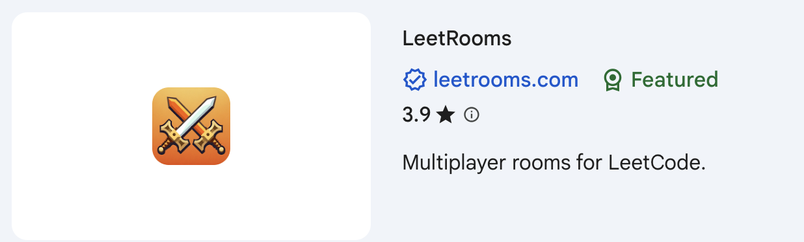
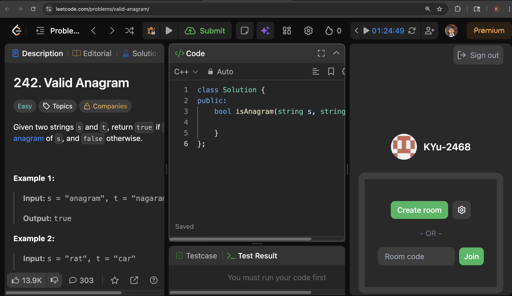

# Pre-Lecture Setup Checklist

⚠️ **This setup MUST be completed before the lecture.**  
Please complete all steps and verify each one before class.

---

## 1️⃣ Create Required Accounts

Make sure you have accounts for the following platforms:

### ✅ GitHub

-   Sign up: https://github.com/
-   Choose a professional username (you will use this long-term)
-   Verify your email address

---

### ✅ LeetCode

-   Sign up: https://leetcode.com/
-   Complete your profile
-   Make sure you can open and run a problem

---

### ✅ CodeBloom

-   Sign up: https://codebloom.patinanetwork.org/login
-   Complete profile and sync with LeetCode
-   Confirm you can log in successfully

---

### ✅ NeetCode

-   We'll be using NeetCode for practice and homework: https://neetcode.io/practice/practice/blind75

---

## 2️⃣ Install Google Chrome

These tools require **Google Chrome**.

-   Download: https://www.google.com/chrome/
-   Make sure Chrome opens correctly

---

## 3️⃣ Install Required Chrome Extensions

Open Chrome and install the following extensions:

### 🧩 LeetRooms

-   Chrome Web Store: https://chromewebstore.google.com/
-   Search for **LeetRooms**
-   Click **Add to Chrome**
-   

✅ Verify: Open LeetCode → LeetRooms icon should appear in the toolbar

---

### 🧩 LeetSync (Optional)

-   Chrome Web Store: https://chromewebstore.google.com/
-   Search for **LeetSync**
-   Click **Add to Chrome**

✅ Verify: Open LeetCode → LeetSync should detect your account

---

## 4️⃣ Connect LeetSync to GitHub

1. Open LeetCode
2. Click the **LeetSync** extension
3. Log in with **GitHub**
4. Authorize repository access
5. Select or create a repository for LeetCode solutions

⚠️ **Do NOT make the repository private unless instructed**

---

## 5️⃣ Verify GitHub Setup

Confirm the following:

-   You can log in to GitHub
-   You can create a repository
-   You see commits appear when syncing from LeetCode

---

## 6️⃣ Test Everything (IMPORTANT)

Complete **one easy LeetCode problem** and confirm:

-   ✅ The problem runs successfully
-   ✅ LeetSync pushes the solution to GitHub
-   ✅ The solution appears in your repository
-   ✅ NeetCode problem pages load correctly

---

## 🛠 Common Issues & Fixes

### LeetSync not syncing

-   Refresh LeetCode
-   Log out and log back into GitHub
-   Reauthorize LeetSync permissions

### Chrome extension not showing

-   Click the puzzle icon → Pin the extension
-   Restart Chrome

---

## ✅ Setup Complete

If you can:

-   Solve a LeetCode problem
-   See it synced to GitHub
-   Access NeetCode

🎉 **You are ready for the lecture!**

If you have issues, bring screenshots to class.
